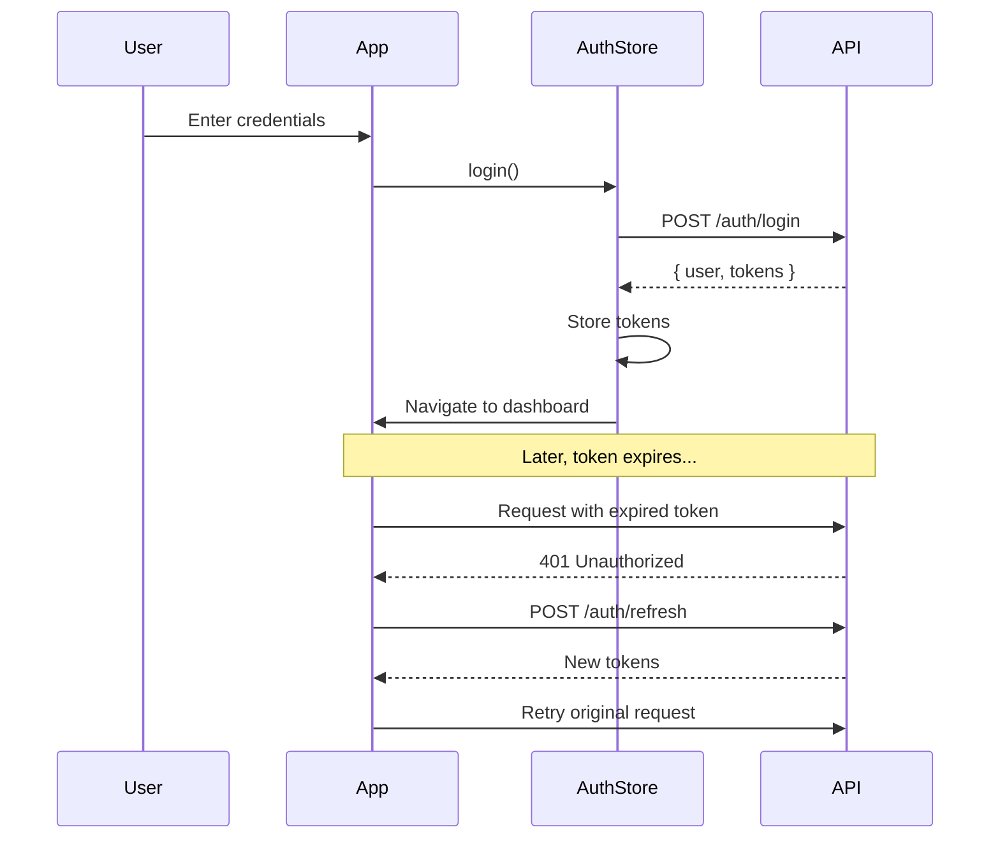

# 🚀 Angular Structure

<div align="center">


**A production-ready Angular 21 starter template with enterprise-grade architecture**

[Features](#-features) • [Quick Start](#-quick-start) • [Architecture](#-architecture) • [API Integration](#-api-integration) • [Contributing](#-contributing)

</div>

---

## ✨ Features

### 🏗️ Modern Architecture
- **Angular 21.1.0** - Latest Angular with Zoneless Change Detection
- **Standalone Components** - No NgModules, cleaner code organization
- **Lazy Loading** - Optimized bundle sizes with selective preloading
- **Feature-Based Structure** - Scalable modular organization

### 🔐 Authentication & Security
- **JWT Authentication** - Token-based auth with Bearer headers
- **Automatic Token Refresh** - Seamless token renewal on 401 errors
- **Route Guards** - Auth, NoAuth, and Role-based protection
- **Request Queuing** - Queue requests during token refresh

### 📦 State Management
- **NgRx SignalStore** - Modern reactive state management
- **Auth Store** - User authentication state
- **User Store** - Profile and preferences management
- **Persistent State** - LocalStorage integration

### 🎨 UI Components
- **PrimeNG 19** - Enterprise UI component library
- **Toast Notifications** - Animated feedback messages
- **Confirm Dialog** - Reusable confirmation modal
- **Loading Spinner** - Global loading indicator
- **Form Errors** - Validation message display

---

## 🚀 Quick Start

### Prerequisites

- Node.js 18+ 
- npm 9+

### Installation

```bash
# Clone the repository
git clone https://github.com/yourusername/angular-structure.git
cd angular-structure

# Install dependencies
npm install

# Start development server
npm run start
```

Open [http://localhost:4200](http://localhost:4200) in your browser.

### Build for Production

```bash
npm run build
```

---

## 📁 Architecture

```
src/app/
├── 📂 core/                    # Singleton services & utilities
│   ├── guards/                 # Route protection
│   │   ├── auth.guard.ts       # Authenticated routes
│   │   ├── no-auth.guard.ts    # Guest-only routes
│   │   └── role.guard.ts       # Role-based access
│   ├── interceptors/           # HTTP interceptors
│   │   ├── auth.interceptor.ts # Token injection & refresh
│   │   ├── error.interceptor.ts# Error handling
│   │   └── loading.interceptor.ts
│   ├── services/               # Core services
│   │   ├── api.service.ts      # Generic HTTP client
│   │   ├── storage.service.ts  # LocalStorage wrapper
│   │   └── notification.service.ts
│   ├── initializers/           # App initialization
│   └── strategies/             # Router strategies
│
├── 📂 shared/                  # Reusable components
│   ├── components/             # UI components
│   │   ├── loading-spinner/
│   │   ├── form-errors/
│   │   ├── notification-toast/
│   │   └── confirm-dialog/
│   ├── pipes/                  # Custom pipes
│   │   ├── truncate.pipe.ts
│   │   └── time-ago.pipe.ts
│   ├── directives/             # Custom directives
│   └── validators/             # Form validators
│
├── 📂 store/                   # NgRx SignalStore
│   ├── auth/                   # Authentication state
│   │   ├── auth.models.ts
│   │   └── auth.store.ts
│   └── user/                   # User profile state
│       ├── user.models.ts
│       └── user.store.ts
│
├── 📂 features/                # Lazy-loaded modules
│   ├── auth/                   # Authentication
│   │   ├── components/
│   │   │   ├── login/
│   │   │   ├── register/
│   │   │   ├── forgot-password/
│   │   │   └── reset-password/
│   │   ├── services/
│   │   └── auth.routes.ts
│   ├── dashboard/              # Main dashboard
│   └── user-management/        # Profile & settings
│
├── 📂 layouts/                 # Layout components
│   └── main-layout/            # Sidebar navigation
│
├── app.config.ts               # App configuration
├── app.routes.ts               # Root routing
└── app.ts                      # Root component
```

---

## 🛣️ Routes

| Route | Component | Guard | Description |
|-------|-----------|-------|-------------|
| `/auth/login` | LoginComponent | NoAuth | User login |
| `/auth/register` | RegisterComponent | NoAuth | New user registration |
| `/auth/forgot-password` | ForgotPasswordComponent | NoAuth | Password reset request |
| `/auth/reset-password/:token` | ResetPasswordComponent | NoAuth | Password reset form |
| `/dashboard` | DashboardComponent | Auth | Main dashboard |
| `/user` | ProfileComponent | Auth | User profile |
| `/user/edit` | ProfileEditComponent | Auth | Edit profile |
| `/user/preferences` | PreferencesComponent | Auth | User settings |

---

## 🔌 API Integration

### Connecting to Your Backend

1. **Update Environment**

```typescript
// src/environments/environment.ts
export const environment = {
  production: false,
  apiUrl: 'https://your-api.com/api',
  // ...
};
```

2. **Update Auth Service**

```typescript
// src/app/features/auth/services/auth.service.ts
login(credentials: LoginCredentials): Observable<AuthResponse> {
  return this.api.post<AuthResponse>('/auth/login', credentials);
}
```

3. **Update User Service**

```typescript
// src/app/features/user-management/services/user.service.ts
getProfile(): Observable<UserProfile> {
  return this.api.get<UserProfile>('/user/profile');
}
```

### Expected API Responses

**Login Response:**
```json
{
  "data": {
    "user": {
      "id": "string",
      "email": "string",
      "firstName": "string",
      "lastName": "string",
      "roles": ["user"]
    },
    "tokens": {
      "accessToken": "string",
      "refreshToken": "string",
      "expiresIn": 3600
    }
  }
}
```

---

## 🧩 Using Shared Components

### Toast Notifications

```typescript
import { NotificationService } from '@core/services/notification.service';

constructor(private notificationService: NotificationService) {}

// Show notifications
this.notificationService.success('Operation successful!');
this.notificationService.error('Something went wrong');
this.notificationService.warning('Please check your input');
this.notificationService.info('Did you know?');
```

### Confirm Dialog

```typescript
import { ConfirmDialogComponent } from '@shared/components/confirm-dialog/confirm-dialog.component';

@ViewChild(ConfirmDialogComponent) dialog!: ConfirmDialogComponent;

deleteItem() {
  this.dialog.open();
}

onConfirmed() {
  // Perform delete action
}
```

### Form Validation Errors

```html
<input formControlName="email" />
<app-form-errors [control]="form.get('email')" fieldName="Email" />
```

---

## 🔒 Authentication Flow



---

## 🛠️ Development

### Scripts

| Command | Description |
|---------|-------------|
| `npm start` | Start dev server on port 4200 |
| `npm run build` | Production build |
| `npm run watch` | Build with watch mode |

### Code Style

This project uses:
- **Prettier** for code formatting
- **TypeScript Strict Mode** for type safety
- **Angular Style Guide** conventions

---

## 📝 Environment Variables

| Variable | Description | Default |
|----------|-------------|---------|
| `apiUrl` | Backend API URL | `http://localhost:8000/api` |
| `tokenKey` | LocalStorage key for access token | `auth_token` |
| `refreshTokenKey` | LocalStorage key for refresh token | `refresh_token` |

---

## 🤝 Contributing

1. Fork the repository
2. Create a feature branch (`git checkout -b feature/amazing-feature`)
3. Commit your changes (`git commit -m 'Add amazing feature'`)
4. Push to the branch (`git push origin feature/amazing-feature`)
5. Open a Pull Request

---

## 📄 License

This project is licensed under the MIT License - see the [LICENSE](LICENSE) file for details.

---

<div align="center">

**Built with ❤️ using Angular 21**

[⬆ Back to Top](#-angular-structure)

</div>
